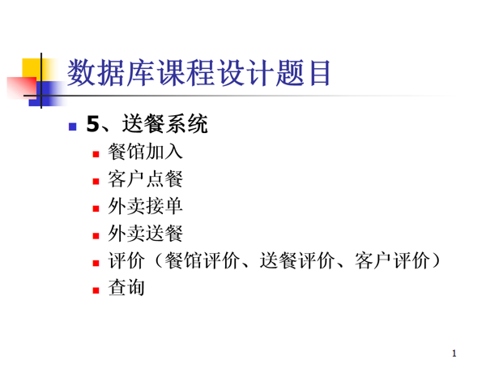
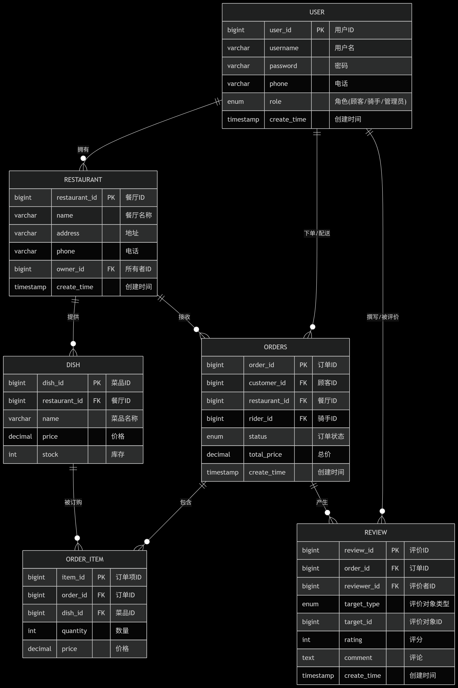

## 选题
送餐系统

### ai分析需求

书写送餐系统，有
餐馆加入
客户点餐
外卖接单
外卖送餐
评价（餐馆评价、送餐评价、客户评价）
查询功能。这是我的数据库设计作业。我想利用springboot和Hbuilder书写。请帮我设计数据库和指导代码书写

### 数据库设计
-- 用户表
CREATE TABLE user (
    user_id BIGINT PRIMARY KEY AUTO_INCREMENT,
    username VARCHAR(50) NOT NULL,
    password VARCHAR(100) NOT NULL,
    phone VARCHAR(20),
    role ENUM('customer', 'rider', 'admin') NOT NULL,
    create_time TIMESTAMP DEFAULT CURRENT_TIMESTAMP
);

-- 餐馆表
CREATE TABLE restaurant (
    restaurant_id BIGINT PRIMARY KEY AUTO_INCREMENT,
    name VARCHAR(100) NOT NULL,
    address VARCHAR(200) NOT NULL,
    phone VARCHAR(20),
    owner_id BIGINT,
    create_time TIMESTAMP DEFAULT CURRENT_TIMESTAMP,
    FOREIGN KEY (owner_id) REFERENCES user(user_id)
);

-- 菜品表
CREATE TABLE dish (
    dish_id BIGINT PRIMARY KEY AUTO_INCREMENT,
    restaurant_id BIGINT NOT NULL,
    name VARCHAR(100) NOT NULL,
    price DECIMAL(10,2) NOT NULL,
    stock INT DEFAULT 100,
    FOREIGN KEY (restaurant_id) REFERENCES restaurant(restaurant_id)
);

-- 订单表
CREATE TABLE orders (
    order_id BIGINT PRIMARY KEY AUTO_INCREMENT,
    customer_id BIGINT NOT NULL,
    restaurant_id BIGINT NOT NULL,
    rider_id BIGINT,
    status ENUM('created','accepted','delivering','completed','cancelled') DEFAULT 'created',
    total_price DECIMAL(10,2),
    create_time TIMESTAMP DEFAULT CURRENT_TIMESTAMP,
    FOREIGN KEY (customer_id) REFERENCES user(user_id),
    FOREIGN KEY (restaurant_id) REFERENCES restaurant(restaurant_id),
    FOREIGN KEY (rider_id) REFERENCES user(user_id)
);

-- 订单详情表
CREATE TABLE order_item (
    item_id BIGINT PRIMARY KEY AUTO_INCREMENT,
    order_id BIGINT NOT NULL,
    dish_id BIGINT NOT NULL,
    quantity INT NOT NULL,
    price DECIMAL(10,2) NOT NULL,
    FOREIGN KEY (order_id) REFERENCES orders(order_id),
    FOREIGN KEY (dish_id) REFERENCES dish(dish_id)
);

-- 评价表
CREATE TABLE review (
    review_id BIGINT PRIMARY KEY AUTO_INCREMENT,
    order_id BIGINT NOT NULL,
    reviewer_id BIGINT NOT NULL,
    target_type ENUM('restaurant','rider','customer') NOT NULL,
    target_id BIGINT NOT NULL,
    rating INT CHECK(rating BETWEEN 1 AND 5),
    comment TEXT,
    create_time TIMESTAMP DEFAULT CURRENT_TIMESTAMP,
    FOREIGN KEY (order_id) REFERENCES orders(order_id),
    FOREIGN KEY (reviewer_id) REFERENCES user(user_id)
);

表关系详细解释
1. 用户表(user)与其他表的关系
与餐厅表(restaurant)：一对多关系。一个用户可以拥有多家餐厅（owner_id外键），但一家餐厅只能有一个所有者。

与订单表(orders)：一对多关系。一个用户可以下多个订单（customer_id），一个骑手可以配送多个订单（rider_id）。

与评价表(review)：一对多关系。一个用户可以撰写多个评价（reviewer_id），也可以被多个评价所指向（通过target_id和target_type）。

2. 餐厅表(restaurant)与其他表的关系
与用户表(user)：多对一关系。多家餐厅可以属于同一个用户（但通常不会）。

与菜品表(dish)：一对多关系。一家餐厅可以提供多种菜品。

与订单表(orders)：一对多关系。一家餐厅可以接收多个订单。

3. 菜品表(dish)与其他表的关系
与餐厅表(restaurant)：多对一关系。多种菜品属于同一家餐厅。

与订单项表(order_item)：一对多关系。一种菜品可以出现在多个订单项中。

4. 订单表(orders)与其他表的关系
与用户表(user)：多对一关系。多个订单可以由同一个顾客下单，或多个订单由同一个骑手配送。

与餐厅表(restaurant)：多对一关系。多个订单可以指向同一家餐厅。

与订单项表(order_item)：一对多关系。一个订单可以包含多个订单项。

与评价表(review)：一对多关系。一个订单可以产生多个评价（对餐厅、骑手、顾客的评价）。

5. 订单项表(order_item)与其他表的关系
与订单表(orders)：多对一关系。多个订单项属于同一个订单。

与菜品表(dish)：多对一关系。多个订单项可以指向同一种菜品。

6. 评价表(review)与其他表的关系
与订单表(orders)：多对一关系。多个评价可以针对同一个订单。

与用户表(user)：多对一关系。多个评价可以由同一个用户撰写，或多个评价指向同一个用户（通过target_id和target_type）。

### 开发工具
#### 后端springboot
<<<<<<< HEAD
#### 前端javascript（Hbuilder工具）
=======
#### 前端javascript（Hbuilder工具）

## 设计思路

### 登录界面设计（login）
注册时可以选择骑手和用户
参馆人员先作为用户加入，在用户端若申请餐馆则在个人中心可以拥有餐馆界面

### 用户界面设计
在用户端可以在各个餐馆点餐，先进入餐馆，再点餐  
并且用户可以看到个人的点餐记录，可以同骑手进行交流，同对已完成订单评价等

### 骑手界面设计
在骑手界面可查看订单结单等

### 餐馆老板界面设计

### 管理员界面设计
禁用餐馆老板，新增管理员
>>>>>>> 7147365 (8.28)
